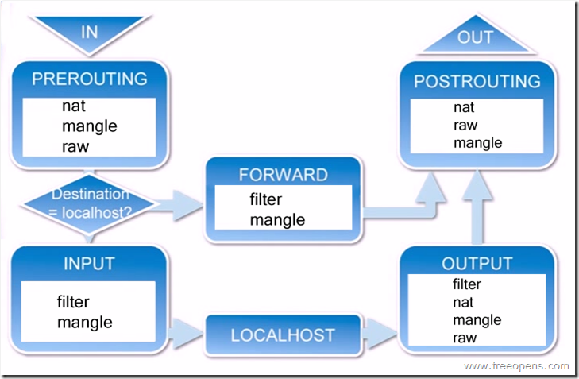

# iptables

## References

-   [iptables in archwiki](https://wiki.archlinux.org/title/Iptables_(%E7%AE%80%E4%BD%93%E4%B8%AD%E6%96%87)#%E5%9F%BA%E6%9C%AC%E6%A6%82%E5%BF%B5)
-   [iptables详解及一些常用规则](https://www.jianshu.com/p/ee4ee15d3658)
-   man iptables

## tables, chains, targets 的概念

iptables 管理防火墙的工具。

防火墙下有多个 tables(filter, nat, mangle, ...), 一个表可有多个 chains(a list of rules), chains 的每一行是一个 rule。

### Tables

每个表负责一个功能。一般有以下表：

-   filter
-   nat
-   mangle
-   raw
-   security

常用的是 filter 和 nat，其他一般用不到。

### Chains, Targets

Chains 的每一个 rule 都有一个 target, 如果匹配则包转到 target。该 target 可以是用户 chains 或特殊的 target（ACCEPT, DROP, RETURN）。特殊的 target 代表某个动作。

一般有以下 Chains

-   PREROUTING chain
-   POSTROUTING chain
-   INPUT chain
-   OUTPUT chain
-   FORWARD chain

每个 Chains 作用的阶段

## 命令格式

`iptables [-t table] <commands> <chain> [<rulenum>] <rule-specification>`

    rule-specification = [matches...] [target]

    table 默认是 filter
    rulenum 就是 line number。可加 --line-number 列出。

    matches 参数:

        # 进/出的接口（如 eth0）
        -i/-o
        # 协议（/etc/protocols 里的协议（较低层的协议）。如 tcp, udp）
        -p
        # 源地址/目的地址
        -s/-d
        # 源端口/目的端口（用 /etc/service（应用层的协议） 的字符串代表数字也可）
        # 前提要指定 -p tcp/udp 才能。
        --sport/--dport

        all: 表示所有
        any:?

## LOG target

    iptables -t filter -A OUTPUT -p tcp --dport 80 -j LOG --log-prefix='logprefix: '
    curl www.baidu.com

    grep -ir "logprefix" /var/log/*
        tail /var/log/syslog
        tail /var/log/kern.log
        tail /var/log/messages

## 常用命令

    # ## 管理链的 rules
    # AI(增)D(删)R(改)L(List)C(Check)
    iptables [-t table] {-A|-C|-D} <chain> <rule-specification>
    iptables [-t table] -D <chain> <rulenum>
    iptables [-t table] -I <chain> [<rulenum>] <rule-specification>
    iptables [-t table] -R <chain> <rulenum> <rule-specification>
    # ### rule-specification
    rule-specification = [matches...] [target]
    match = -m matchname [per-match-options]
    target = -j targetname [per-target-options]

    # 列出 table 的所有 chains
    iptables -t filter -nL [-v]

    # 新建/重命名/删除 chain
    iptables -t filter -N <new-chain>
    iptables -t filter -E <old-chain> <new-chain>
    iptables -t filter -X <chain>

    # 有些 linux 发行版防火墙的配置不会保存到磁盘，所以重启之后清空。所以需要在开机时导入 iptables 的配置。
    iptables-save > <backupfile>
    iptables-save < <backupfile>

    # 删除所有设置
    iptables -F [chain]

    # 将 filter 表的 FORWARD 链默认的规则由 ACCEPT 改成 DROP。
    iptables -P FORWARD DROP

for example

    iptables -t filter -N ChainTest
    # 此规则无意义，只是为了演示。
    iptables -t filter -A ChainTest -i lo -o lo -p tcp -s 192.168.1.1/24 --sport 8080 -d 192.168.1.2/24 --dport 8081
    iptables -t filter -A INPUT -j ChainTest
    iptables -t filter -nL
    iptables -t filter -X ChainTest
    iptables -t filter -F INPUT

## ufw

ufw 也是管理防火墙的。iptable 入门比较难，ufw 操作比较简单。

它们之间的联系

> `ufw enable; iptables` 可查看它们的联系。 
> ufw 通过添加多个自定义的 chain 作为基础 chain（INPUT, OUTPUT, ...） 的 target 来实现的配置防火墙的。

### 常用命令

    # 重置到刚安装时。
    ufw reset

    # port/proto 要依赖于 from/to
    ufw app list

    ufw status [numbered] [verbose]

    # 默认是 append。
    ufw [[delete] | [insert <rulenum>] {allow|deny|reject|limit} <port或service name>[/<proto>]
    ufw [[delete] | [insert <rulenum>] {allow|deny|reject|limit} {from|to} <addr> [port <port>]

    ufw delete <rulenum>

for example

    ufw allow in on lo proto tcp from 192.168.1.1/24 port 8080 to 192.168.1.2/24 port 8081
