# Design Patterns

## Content

${toc}

## 说明

GoF 23 种设计模式

[Online Server of PlantUML](http://www.plantuml.com/plantuml/uml/SyfFKj2rKt3CoKnELR1Io4ZDoSa70000)

## References

-   《设计模式：可复用面向对象软件的基础》
-   《Head First 设计模式》
-   [设计模式](https://www.runoob.com/design-pattern/design-pattern-tutorial.html)
-   [设计模式 (计算机)](https://zh.wikipedia.org/wiki/%E8%AE%BE%E8%AE%A1%E6%A8%A1%E5%BC%8F_(%E8%AE%A1%E7%AE%97%E6%9C%BA))
-   [JakubVojvoda/design-patterns-cpp](https://github.com/JakubVojvoda/design-patterns-cpp)

## Creational patterns（创建型模式）

### Abstract factory（抽象工厂）

意图

> 为一个产品族提供了统一的创建接口。当需要这个产品族的某一系列的时候，可以从抽象工厂中选出相应的系列创建一个具体的工厂类。


plantuml code

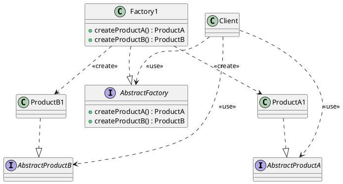

### Builder（生成器）

意图

> 将一个复杂对象的构建与它的表示分离，使得同样的构建过程可以创建不同的表示。


plantuml code

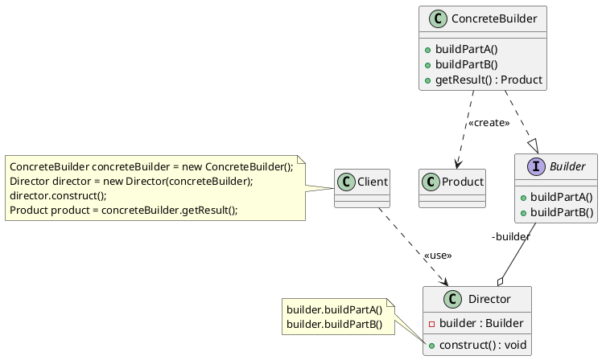

### Factory method（工厂方法）

意图

> 定义一个接口用于创建对象，但是让子类决定初始化哪个类。工厂方法把一个类的实例化下放到子类。


plantuml code

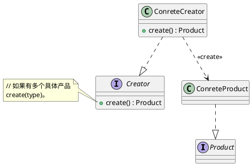

### Prototype（原型）

意图

> 用原型实例指定创建对象的种类，并且通过拷贝这些原型创建新的对象。


plantuml code

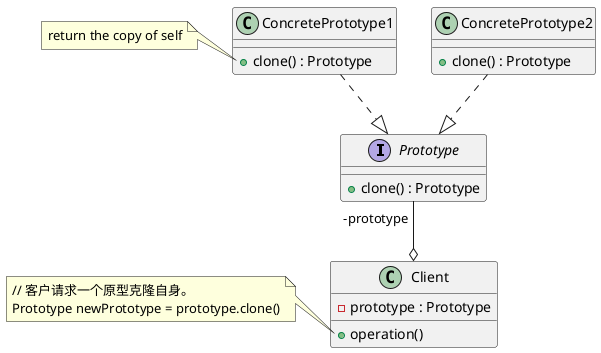

### Singleton（单件）

意图

> 确保一个类只有一个实例，并提供对该实例的全局访问。


plantuml code

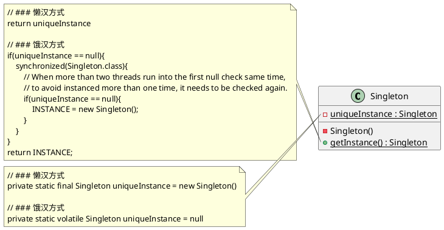

[有两种方式实现](https://zh.wikipedia.org/wiki/%E5%8D%95%E4%BE%8B%E6%A8%A1%E5%BC%8F)

1.  懒汉方式。指全局的单例实例在第一次被使用时构建。
2.  饿汉方式。指全局的单例实例在类装载时构建。

[*C++和双重检查锁定模式(DCLP)的风险*](https://blog.csdn.net/linlin003/article/details/79012416)

> 因为 C/C++ 语言没有线程的概念，所以只用 C/C++ 通过双重检查锁定模式(DCLP)来实现线程安全的单例模式是不可能的。

## Structural patterns（结构型模式）

### Adapter（适配器）

意图

> 将某个类的接口转换成客户端期望的另一个接口表示。适配器模式可以消除由于接口不匹配所造成的类兼容性问题。

#### Object adapter（对象适配器）

用组合的方法实现。


plantuml code

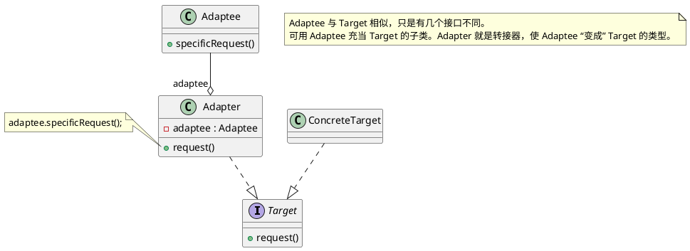

#### Class adapter（类适配器）

用多继承的方法实现。


plantuml code

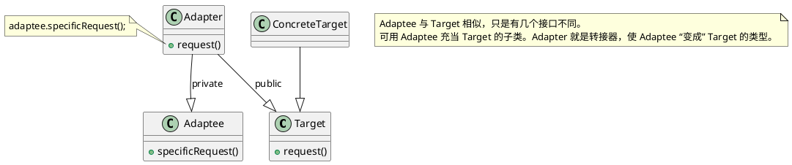

### Bridge（桥接）

意图

> 将抽象部分与它的实现部分分离，使它们都可以独立地变化。


plantuml code

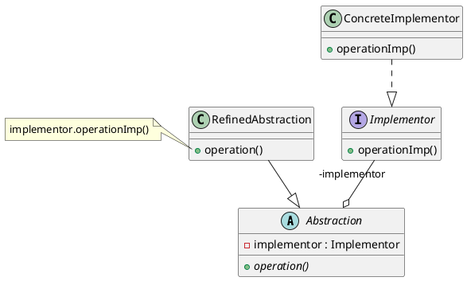

### Composite（组合）

意图

> 把多个对象组成树状结构来表示局部与整体，这样用户可以一样的对待单个对象和对象的组合。（一个结点或多个结点都可看作是一棵树）


plantuml code

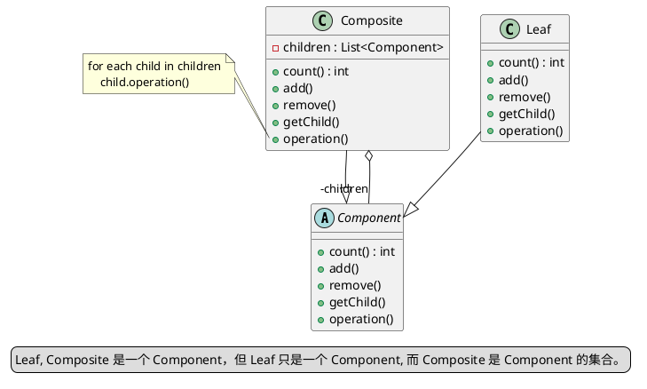

### Decorator（装饰）

意图

> 动态地给一个对象添加一些额外的职责。就增加功能来说， 装饰模式相比生成子类更为灵活。


plantuml code

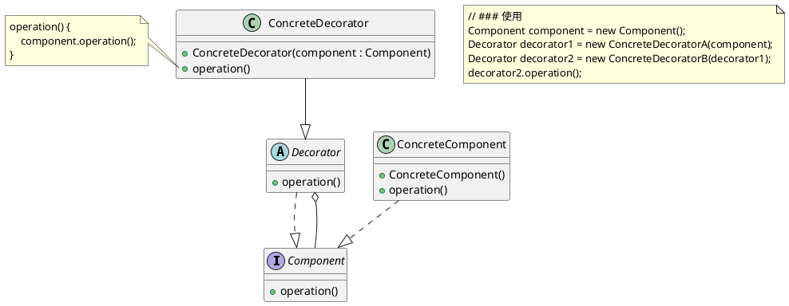

### Facade（外观）

意图

> 为子系统中的一组接口提供一个一致的界面， 外观模式定义了一个高层接口，这个接口使得这一子系统更加容易使用。


plantuml code

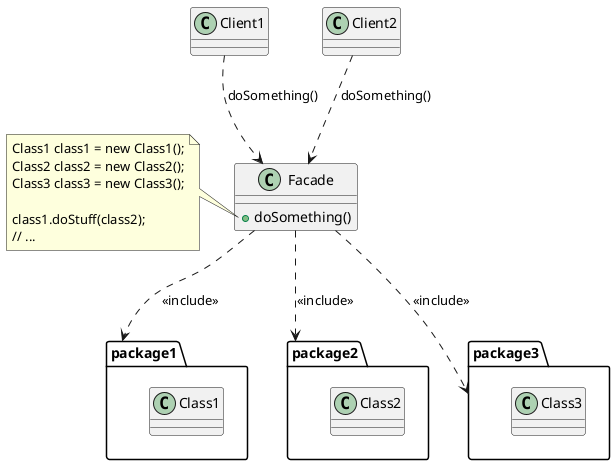

### Flyweight（享元）

意图

> 运用共享技术有效地支持大量细粒度的对象。

例子

> 典型的享元模式的例子为文书处理器中以图形结构来表示字符。一个做法是，每个字形有其字型外观, 字模 metrics, 和其它格式资讯，但这会使每个字符就耗用上千字节。取而代之的是，每个字符参照到一个共享字形物件，此物件会被其它有共同特质的字符所分享；只有每个字符（文件中或页面中）的位置才需要另外储存。
>
> *位置是内蕴状态，存储在非共享享元中。而字型外观，字模等是外蕴状态，存储在共享享元中。共享享元由 FlyweightFactory 放入 map/unordered_map 中管理。*


plantuml code

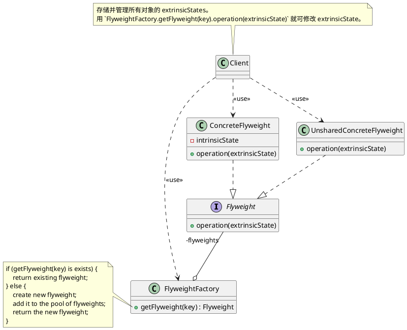

### Proxy（代理）

意图

> 为其他对象提供一个代理以控制对这个对象的访问。


plantuml code

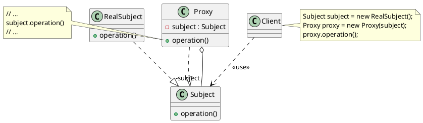

## Behavioural patterns（行为模式）

### Chain of responsibility（责任链）

意图

> 为解除请求的发送者和接收者之间耦合，而使多个对象都有机会处理这个请求。将这些对象连成一条链，并沿着这条链传递该请求，直到有一个对象处理它。


plantuml code

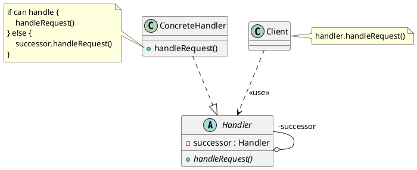

### Command（命令）

意图

> 将一个请求封装为一个对象，从而使你可用不同的请求对客户进行参数化；对请求排队或记录请求日志，以及支持可取消的操作。
>
> *请求最终会调用接收者具体实现的功能，而调用者只需调用设置好的请求即可。*


plantuml code

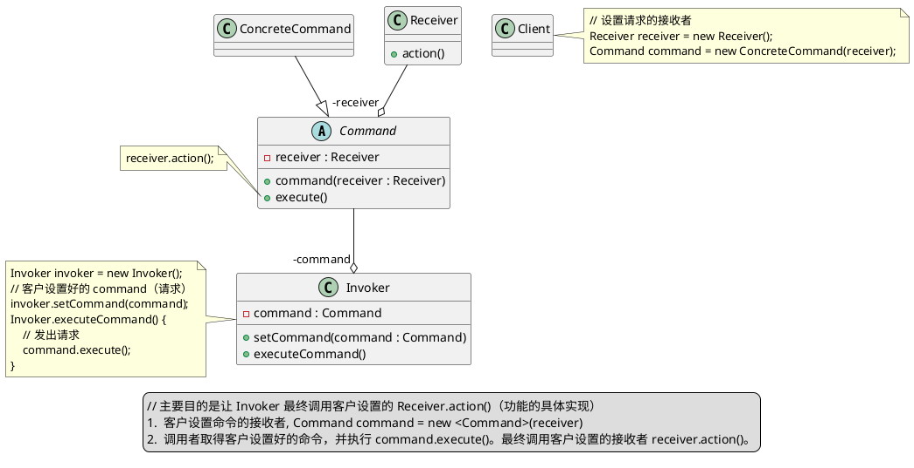

### Interpreter（解释器）

意图

> 给定一个语言, 定义它的文法的一种表示，并定义一个解释器, 该解释器使用该表示来解释语言中的句子。

例子：`C++ 布尔表达式`

> TerminalExp: true, false, <value><br>
> NonTerminalExp: and, or, not


plantuml code

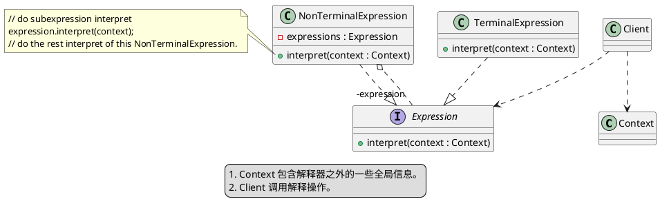

### Iterator（迭代器）

意图

> 提供一种方法顺序访问一个聚合对象中各个元素, 而又不需暴露该对象的内部表示。


plantuml code

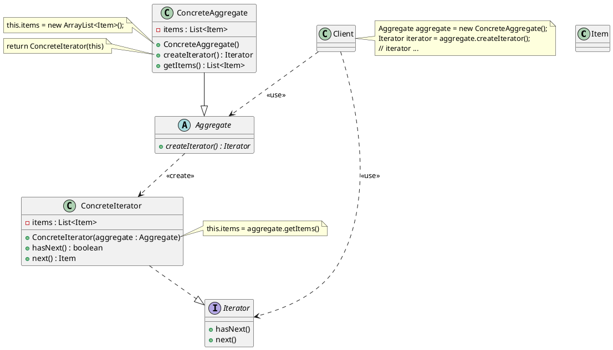

### Mediator（中介者）

意图

> 用一个中介对象来封装一系列的对象交互。中介者使各对象不需要显式地相互引用，从而使其耦合松散，而且可以独立地改变它们之间的交互。
>
> Colleagues 都聚合 Mediator，Mediator 也都聚合 Colleagues 即可。这样 Colleagues 之间不用相互聚合。


plantuml code

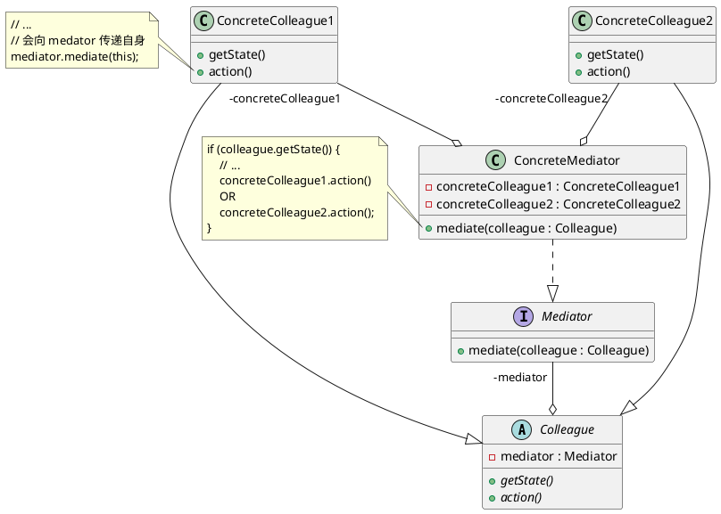

### Memento（备忘录）

意图

> 备忘录对象是一个用来存储另外一个对象内部状态的快照的对象。备忘录模式的用意是在不破坏封装的条件下，将一个对象的状态捉住，并外部化，存储起来，从而可以在将来合适的时候把这个对象还原到存储起来的状态。


plantuml code

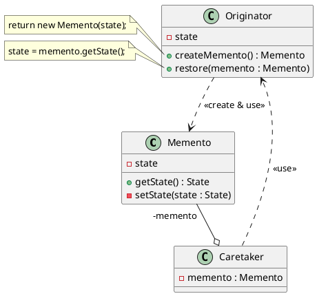

### Observer（观察者）

意图

> 在对象间定义一个一对多的联系性，由此当一个对象改变了状态，所有其他相关的对象会被通知并且自动刷新。


plantuml code

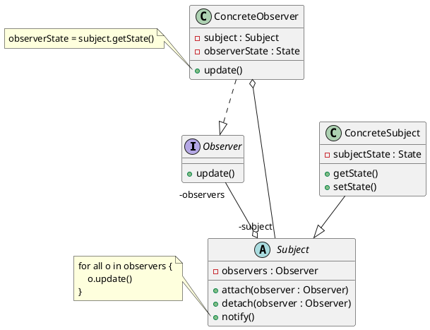

### State（状态）

意图

> 让一个对象在其内部状态改变的时候，其行为也随之改变。状态模式需要对每一个系统可能获取的状态创立一个状态类的子类。当系统的状态变化时，系统便改变所选的子类。


plantuml code

```plantuml
@startuml

interface State {
    + handle() : void
}

class ConcreteStateA {
    + handle() : void
}

class ConcreteStateB {
    + handle() : void
}

class Context {
    - state
    + request() : void
    + getState() : State
    + setState(state : State) : void
    + changeState() : void
}

ConcreteStateA ..|> State
ConcreteStateB ..|> State

State "-state" --o Context

note left of Context::"request()"
    state.handle()
end note

note right of Context::"changeState()"
    // 某些原因引起状态改变，使得 `request()` 调用相应的 `state.handle()`
    switch(value) {
        case 1:
            setState(new ConcreteStateA());
            break;
        case 2:
            setState(new ConcreteStateB());
            break;
        // ...
    }
end note

@enduml
```

### Strategy（策略）

意图

> 定义一个算法的系列，将其各个分装，并且使他们有交互性。策略模式使得算法在用户使用的时候能独立的改变。

例子

> 有许多算法可对一个正文流进行分行。将这些算法硬编进使用它们的类中是不可取的。不同的时候需要不同的算法。


plantuml code

```plantuml
@startuml

interface Strategy {
    + algorithm()
}

class ConcreteStrategy {
    + algorithm()
}

class Context {
    - strategy
    + operation()
}

ConcreteStrategy ..|> Strategy
Strategy --o "-strategy" Context

note right of Context::"operation()"
    strategy.algorithm();
end note

@enduml
```

### Template method（模板方法）

意图

> 定义一个操作中的算法的骨架，而将一些步骤延迟到子类中。模板方法使得子类可以不改变一个算法的结构即可重定义该算法的某些特定步骤。


plantuml code

```plantuml
@startuml

abstract class AbstractClass {
    + templateMethod()
    + primitiveOperationA() {abstract}
    + primitiveOperationB() {abstract}
}

class ConcreteClass {
    + primitiveOperationA()
    + primitiveOperationB()
}

ConcreteClass --|> AbstractClass

note left of AbstractClass::"templateMethod()"
    // `templateMethod()` 已实现，而有些方法要求子类实现。
    // ...
    primitiveOperationA();
    // ...
    primitiveOperationB();
    // ...
end note

@enduml
```

### Visitor（访问者）

意图

> 表示一个作用于某对象结构中的各元素的操作。它使你可以在不改变各元素的类的前提下定义作用于这些元素的新操作。

例子

> 考虑一个编译器，它将源程序表示为一个抽象语法树。该编译器需在抽象语法树上实施某些操作以进行“静态语义”分析，例如检查是否所有的变量都已经被定义了。它也需要生成代码。因此它可能要定义许多操作以进行类型检查、代码优化、流程分析，检查变量是否在使用前被赋初值，等等。
>
> Visitor（作用于元素的操作）: 检查变量是否被定义了；类型检查；检查变量是否在使用前被赋值。<br>
> Element: 抽象语法树（objectStructure）的节点。


plantuml code

```plantuml
@startuml

top to bottom direction

together {
    interface Visitor {
        + visitConcreteElement1(concreteElement1 : ConcreteElement1)
        + visitConcreteElement2(concreteElement2 : ConcreteElement2)
    }

    class ConcreteVisitor1 {
        + visitConcreteElement1(concreteElement1 : ConcreteElement1)
        + visitConcreteElement2(concreteElement2 : ConcreteElement2)
    }

    class ConcreteVisitor2 {
        + visitConcreteElement1(concreteElement1 : ConcreteElement1)
        + visitConcreteElement2(concreteElement2 : ConcreteElement2)
    }
}

together {
    interface Element {
        + accept(visitor : Visitor)
    }

    class ConcreteElement1 {
        + accept(visitor : Visitor)
        + operationA()
    }

    class ConcreteElement2 {
        + accept(visitor : Visitor)
        + operationB()
    }

    note left of ConcreteElement1::"accept(visitor : Visitor)"
        visitor.visitConcreteElement1(this)
    end note

    note left of ConcreteElement2::"accept(visitor : Visitor)"
        visitor.visitConcreteElement2(this)
    end note
}

class ObjectStructure {
    - collection
}

class Client {
    - objectStructure : ObjectStructure
    - visitor1 : ConcreteVisitor1
    - visitor2 : ConcreteVisitor2
    + visitor1Walk()
    + visitor2Walk()
}

ConcreteElement1 ..|> Element
ConcreteElement2 ..|> Element
ConcreteVisitor1 ..|> Visitor
ConcreteVisitor2 ..|> Visitor
Element "-collection" --o ObjectStructure
Client .up.> Visitor : <<use>>
Client .right.> ObjectStructure : <<use>>

note left of ObjectStructure::"collection"
    元素的集合，能枚举集合内的元素。
end note

note left of Client::"visitor1Walk()"
    // 将操作（visitor）作用于 objectStructure 的所有元素
    for (Element element : objectStructure) {
        element.accept(visitor1)
    }
end note

@enduml
```

## 设计模板的七大原则

[面向对象的设计模式有七大基本原则：](https://cloud.tencent.com/developer/article/1650116)

-   合成/聚合复用原则（Composite/Aggregate Reuse Principle，CARP）

    尽量使用合成/聚合，而不是通过继承达到复用的目的。

-   依赖倒转原则（Dependency Inversion Principle，DIP）

    依赖于抽象，不能依赖于具体实现。

    很多模式都抽象出一个抽象基类。而客户一般只使用这个抽象基类。

    ”讲了这么多，估计大家对“倒置”这个词还是有点不理解，那到底什么是“倒置”呢？我们先说“正置”是什么意思，依赖正置就是类间的依赖是实实在在的实现类间的依赖，也就是面向实现编程，这也是正常人的思维方式，我要开车就依赖奔驰车，我要使用电脑就直接依赖笔记本电脑，而编写程序需要的是对现实世界的事物进行抽象，抽象的结果就是有了抽象类和接口，然后我们根据系统设计的需要产生了抽象间的依赖，代替了人们传统思维中的事物间的依赖，“倒置”就是从这里产生“。

-   开闭原则（Open Closed Principle，OCP）

    对扩展开放，对修改关闭。

    定义是：一个软件实体如类、模块和函数应该对扩展开放，对修改关闭。模块应尽量在不修改原（是"原"，指原来的代码）代码的情况下进行扩展。

-   里氏代换原则（Liskov Substitution Principle，LSP）

    所有引用基类的地方必须能透明地使用其子类的对象。

    定义是：所有引用基类的地方必须能透明地使用其子类的对象，也可以简单理解为任何基类可以出现的地方，子类一定可以出现。（《Effective C++》中的“条款 36: 绝不重新定义继承而来的 non-virtual 函数” ，因为这样会破坏 is-a 的关系。）

    里氏代换原则是对"开-闭"原则的补充。

-   单一职责原则（Single Responsibility Principle, SRP）

    一个类只负责一个功能领域中的相应职责。

-   接口隔离原则（Interface Segregation Principle，ISP）

    类之间的依赖关系应该建立在最小的接口上。

    当一个接口过于臃肿时，可以接口拆分为多个接口。然后用这个小接口进行灵活地组合。

    如何看待接口隔离原则和单一职责原则：

    > 单一职责原则是从职责角度出发，而接口隔离是从接口角度出发。有可能满足单一职责原则但是不满足接口隔离原则。

-   迪米特法则（Law of  Demeter，LOD），也叫最少知识原则（Least Knowledge Principle，LKP）

    一个软件实体应当尽可能少的与其他实体发生相互作用。知道得越少越好。

    迪米特法则的初衷在于降低类之间的耦合。由于每个类尽量减少对其他类的依赖，因此，很容易使得系统的功能模块功能独立，相互之间不存在（或很少有）依赖关系。迪米特法则不希望类之间建立直接的联系。如果真的有需要建立联系，也希望能通过它的友元类（中间类或者跳转类）来转达。比如：中介者模式。

个人对于原则的关联性划分：

-   合成/聚合复用原则
-   依赖倒转原则
-   开闭原则、里氏代换原则

    强调扩展，排斥修改。

-   单一职责原则、接口隔离原则、迪米特法则

    强调单一，排斥耦合。
