# markdown tutorial

## References

-   markdown 教程

    -   <https://daringfireball.net/projects/markdown/>

        Markdown 的创建者编写的原始指南

    -   <https://markdown.com.cn/>
    -   <https://www.markdownguide.org/>

        -   <https://www.markdownguide.org/cheat-sheet/>

    -   <http://support.typora.io/Markdown-Reference/>

        typora 的 markdown 教程

    -   <https://docs.github.com/en/github/writing-on-github/basic-writing-and-formatting-syntax>
        
        GFM 语法

    -   <https://github.github.com/gfm/>

        GFM 规格

-   markdown 在线编辑器

    -   <https://stackedit.io/>
        
        支持所有功能
	
-   <https://mermaid-js.github.io/mermaid/#/>

	mermaid 教程

## 基本概念

### markdown 的工作原理


> markdown 的所有特点几乎都可以等价于 html 的某个特点。所以可以以 html 理解 markdown。 同时 markdown 还可使用 html tags。

### markdown flavors（方言）

*markdown 有基本语法与扩展语法。有些方言并不支持扩展语法，还有可能不同于基本语法。*

GFM: GitHub Flavored Markdown

### markdown 的作用

比 html 更加方便地排版文本。

## Basic Syntax

### paragraph and newline

first paragraph

second paragraph


first line  
second line


first line<br />
second line

### 转义字符 \\

[参考](https://daringfireball.net/projects/markdown/syntax#backslash)

```
\   backslash
`   backtick
*   asterisk
_   underscore
{}  curly braces
[]  square brackets
()  parentheses
#   hash mark
+   plus sign
-   minus sign (hyphen)
.   dot
!   exclamation mark
```

***转义字符在 blockquote 中有效，codeblock 中无效***

### Heading

[refer](https://daringfireball.net/projects/markdown/syntax#header)

Markdown supports two styles of headers, Setext and atx.

```markdown
<!-- Setext-style -->

Heading level 1
===============

Heading level 2
----------------

<!-- Atx-style -->

# Heading level 1

## Heading level 2

### Heading level 3

#### Heading level 4

##### Heading level 5

###### Heading level
```
### List

list content 比 list 多缩进四个空格或一个 tab。list content 显示效果会自动缩进。

列表可以嵌套。

#### 有序列表

1. First item

    list content

1. Second item

#### 无序列表

- First item

    list content

- Second item

#### 兼容 GFM 方言

[refer](https://daringfireball.net/projects/markdown/syntax#list)

1.  First item
    -   First item

        list content

            list content

        ```
        list content
        ```

10. Second item

### Blockquote

在 Blockquote 中， ''>" 表示段落分隔符了。应用场景：表示引用别人的东西。

> Dorothy followed her through many of the beautiful rooms in her castle.  
> Dorothy followed her through many of the beautiful rooms in her castle.

> Dorothy followed her through many of the beautiful rooms in her castle.
>
>
> Dorothy followed her through many of the beautiful rooms in her castle.

> Dorothy followed her through many of the beautiful rooms in her castle.
>
>>
>> Dorothy followed her through many of the beautiful rooms in her castle.

<!-- 更好 -->
> Dorothy followed her through many of the beautiful rooms in her castle.
>
> >
> > Dorothy followed her through many of the beautiful rooms in her castle.

### Code

在 \`\` 中放置代码。

At the command prompt, type `nano`.  

#### 在 Code 中输出反引号

``Use `code` in your Markdown file.``

`` `code` ``

#### Others

使 URL 无效  

`http://www.example.com`

### Code Block

缩进四个空格或一个 tab 即可。

    <html>
        <head>
        </head>
    </html>

### Link

*title 是可选的。*

My favorite search engine is [Duck Duck Go](https://duckduckgo.com).  
My favorite search engine is [Duck Duck Go](https://duckduckgo.com "title").

link 中的空格  
[link](https://www.example.com/my%20great%20page)  

#### 锚点链接

[hobbit-hole][1]  
[hobbit-hole][id]  

[1]: https://en.wikipedia.org/wiki/Hobbit#Lifestyle
[1]: <https://en.wikipedia.org/wiki/Hobbit#Lifestyle> "Hobbit lifestyles"
[id]: <https://en.wikipedia.org/wiki/Hobbit#Lifestyle> "Hobbit lifestyles"

#### 页内跳转

[jump to anchor](https://stackoverflow.com/questions/5319754/cross-reference-named-anchor-in-markdown/7335259#7335259)
	
###### <a name="anchorName"></a> headName
###### headName


<br /><br /><br /><br /><br />
<br /><br /><br /><br /><br />
<br /><br /><br /><br /><br />
<br /><br /><br /><br /><br />
<br /><br /><br /><br /><br />
<br /><br /><br /><br /><br />
<br /><br /><br /><br /><br />
<br /><br /><br /><br /><br />

[jump to head](#headname)

[jump to anchor](#anchorName)

#### URLs and Email Addresses

软件对待 \<\> 之中的文本为 URL OR Email Address 而不是纯文本。

<https://www.markdownguide.org>  
<fake@example.com>

### 插入图片

title 是可选的。


### Emphasis（加粗或变斜）

I just love **bold text**.
Italicized text is the *cat's meow*.
This text is ***really important***.

### 水平分隔线

注意：在单独在一个段落中。

---

## Extended Syntax

### 表格

| Syntax      | Description |
| ----------- | ----------- |
| Header      | Title       |
| Paragraph   | Text        |

| Syntax    | Description                |
| ----      | -------------------------- |
| Header    | Title                      |
| Paragraph | Text                       |

| Syntax    | Description | Test Text   |
| :---      | :----:      | ---:        |
| Header    | Title       | Here's this |
| Paragraph | Text        | And more    |

| Function name | Description                    |
| ------------- | ------------------------------ |
| `help()`      | Display the help window.       |
| `destroy()`   | **Destroy your computer!**     |

### Fenced Code Blocks

如果使用缩进四个空格或一个 tab 的方式不方便则可使用此方法。

```
{
  "firstName": "John",
  "lastName": "Smith",
  "age": 25
}
```

#### Syntax Highlighting

支持多种语言。

```json
{
  "firstName": "John",
  "lastName": "Smith",
  "age": 25
}
```

### 脚注

Here's a simple footnote,[^1] and here's a longer one.[^bignote]

[^1]: This is the first footnote. 
[^bignote]: Here's one with multiple paragraphs and code.
    Indent paragraphs to include them in the footnote.
    `{ my code }`
    Add as many paragraphs as you like.

### 标题 ID

可为标题添加 ID。可用于 CSS 渲染。

```
### My Great Heading {#custom-id}
```

### Definition Lists

First Term
: This is the definition of the first term.

Second Term
: This is one definition of the second term.
: This is another definition of the second term.


### Strikethrough

~~The world is flat.~~ We now know that the world is round.

### Task Lists

- [x] Write the press release
- [ ] Update the website
- [ ] Contact the media

### Emoji

***`:` 暂时无法转义。***

Gone camping! :tent: Be back soon.  
That is so funny! :joy:

## 数学公式

markdown 支持完整 LaTex 数学公式语法

$$
\mathbf{V}_1 \times \mathbf{V}_2 =  \begin{vmatrix}
\mathbf{i} & \mathbf{j} & \mathbf{k} \\
\frac{\partial X}{\partial u} &  \frac{\partial Y}{\partial u} & 0 \\
\frac{\partial X}{\partial v} &  \frac{\partial Y}{\partial v} & 0 \\
\end{vmatrix}
$$

## 绘图

### mermaid (支持很多图，不能一一列举)

#### mermaid graph


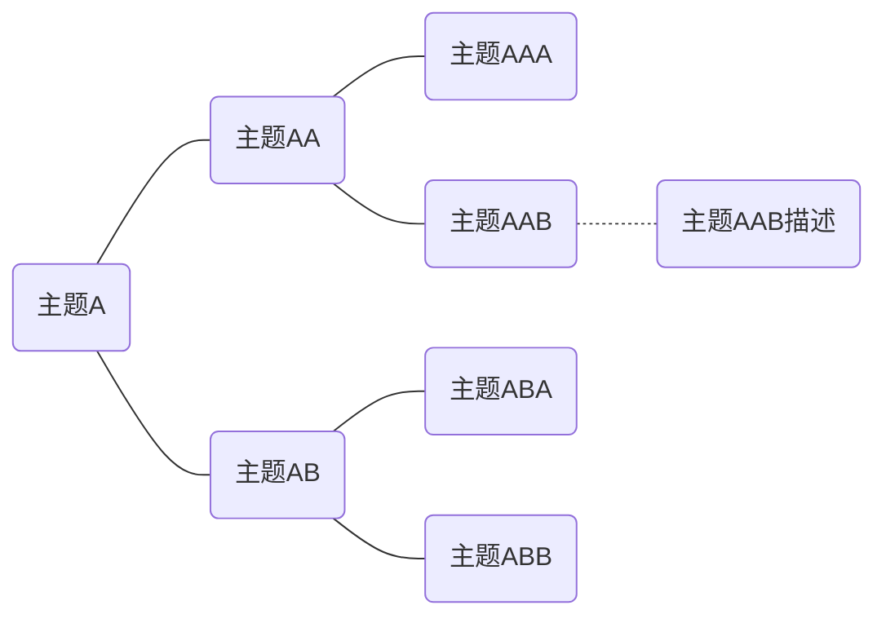

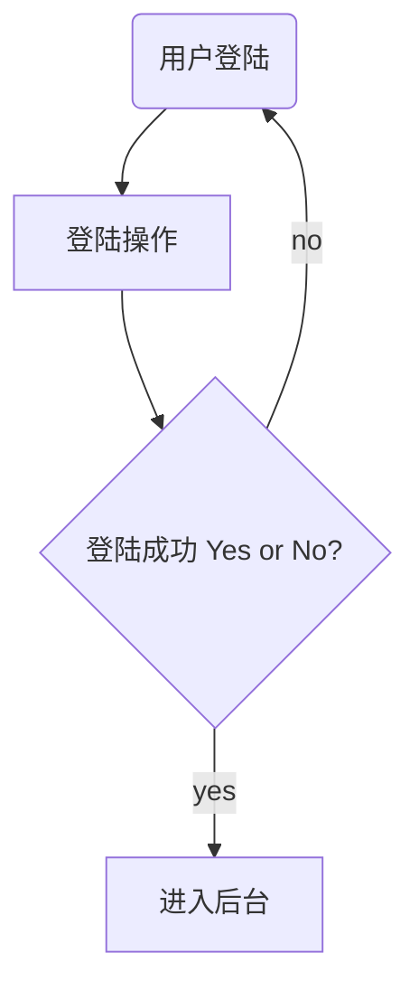

#### mermaid sequenceDiagram

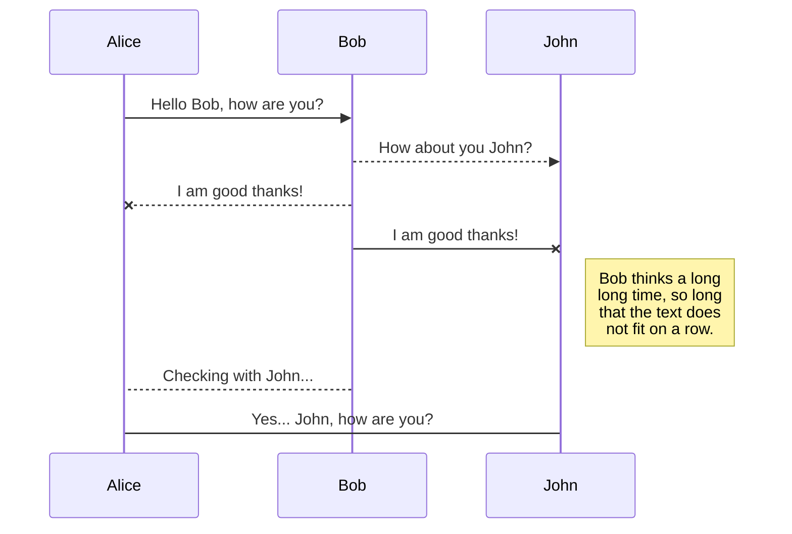

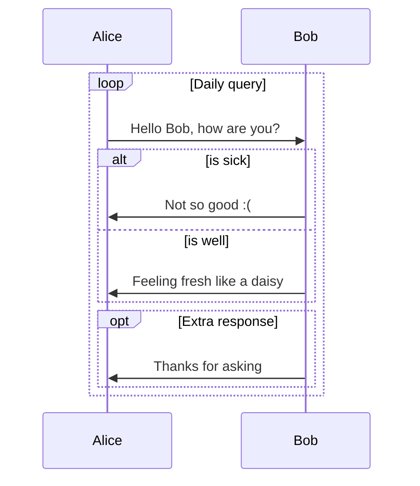

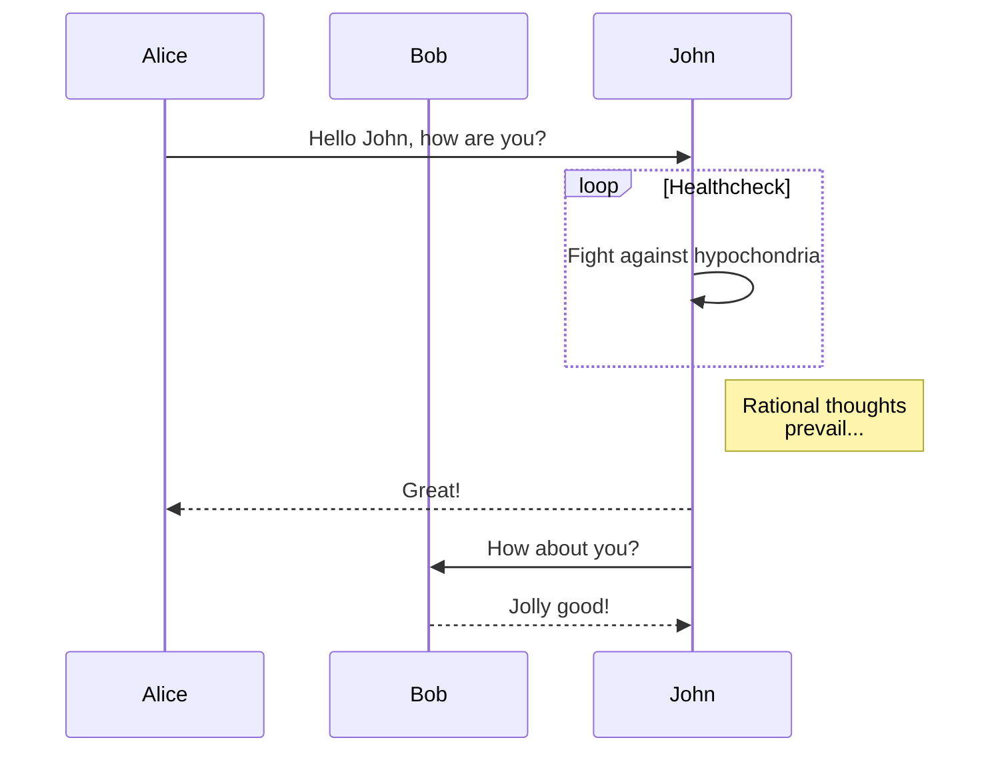

##### mermaid classDiagram

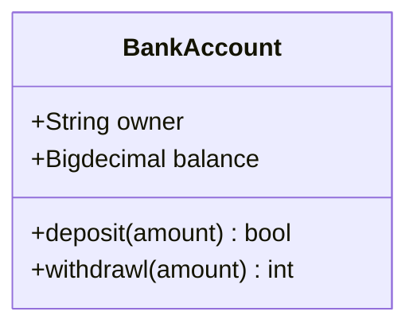

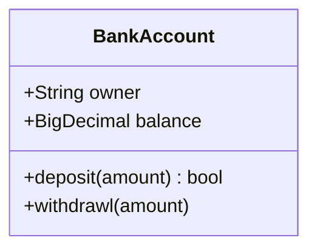

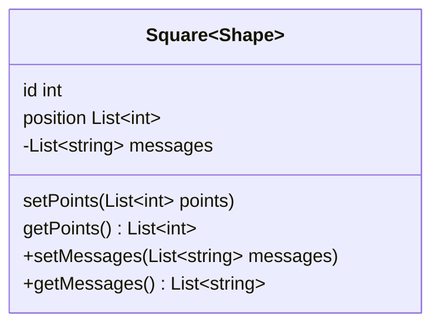

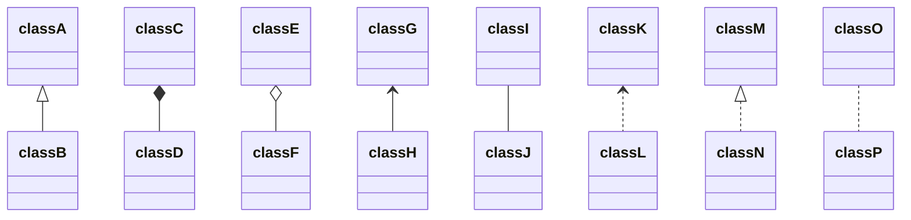
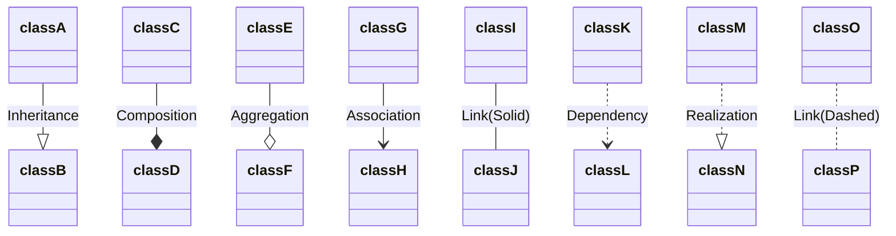

#### mermaid stateDiagram
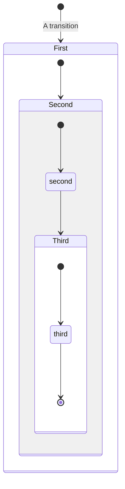

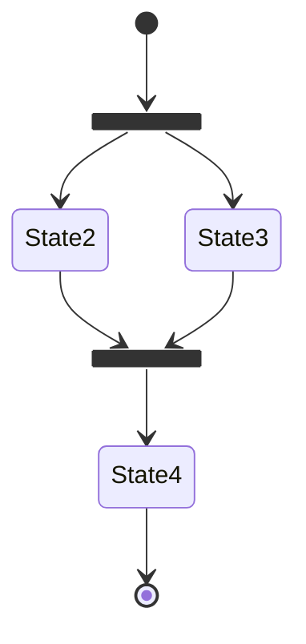

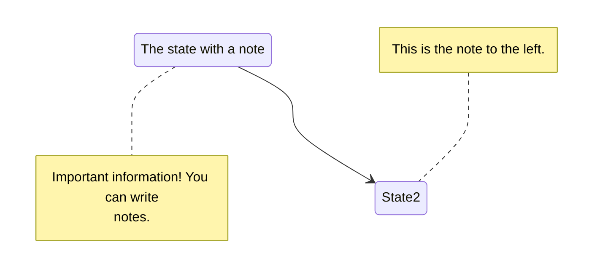

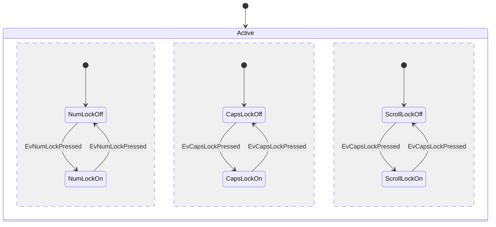

#### mermaid pie

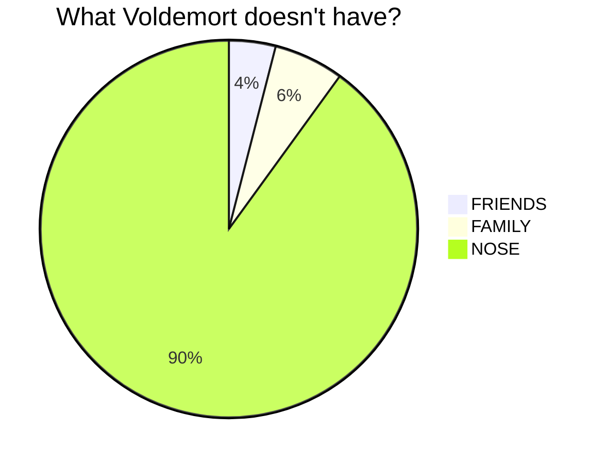

#### mermaid gantt

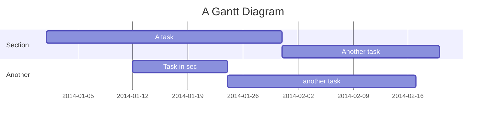

### 绘制流程图 Flowchart

```flow
st=>start: 用户登陆
op=>operation: 登陆操作
cond=>condition: 登陆成功 Yes or No?
e=>end: 进入后台

st->op->cond
cond(yes)->e
cond(no)->op
```

### 绘制序列图 Sequence Diagram

```sequence
    Alice ->> Bob: Hello Bob, how are you?
    Bob-->>John: How about you John?
    Bob--x Alice: I am good thanks!
    Bob-x John: I am good thanks!
    Note right of John: Bob thinks a long<br/>long time, so long<br/>that the text does<br/>not fit on a row.

    Bob-->Alice: Checking with John...
    Alice->John: Yes... John, how are you?
```

## 实践 （个人风格）

以三级标题为主，因为大小比较合适。

如果小标题是列举的，则用 list 代替否则用小标题。如果是不可列举的且是要缩进的则用 >。

标题的说明内容用 <p></p>，不必用 quoteblock。

"综上所述"的内容，放在分隔线下。内容不接上文也用分隔线隔开。

解释/补充的内容的用斜体。quoteblock 内解释/补充的内容不用斜体了，如果多行则排版麻烦。加粗同理。
