# markdown tutorial

### refer:

- <https://www.markdownguide.org/cheat-sheet/>
- <http://support.typora.io/Markdown-Reference/>

	typora 的 markdown 教程

- <https://pandao.github.io/editor.md/index.html>

	markdown 在线编辑器
	
- <https://stackoverflow.com/questions/5319754/cross-reference-named-anchor-in-markdown/7335259#7335259>

	jump to anchor
	
- <https://mermaid-js.github.io/mermaid/#/>

	mermaid 教程

## Basic Syntax

### markdown 的作用

比 html 更加方便地排版文本。

### markdown 与 html

markdown 的所有特点几乎都可以等价于 html 的某个特点。所以可以以 html 理解 markdown。 同时 markdown 还可使用 html tags。

一些软件或平台会添加一些标准没有的功能，所以要为了更好的兼容性，还是以标准为主。且有些软件不完全支持 Externed Syntax。

- 换行：有些软件不用后面后面加两个空格也可以实现换行。比如：typora，当然可以是设置的。
- Definition List: 比如：typora 不支持。
- URLs and Email Addresses: 放在 \<\> 中区别于纯文本。但是一些软件会额外检测并处理，所以在一些软件中可用不用添加 \<\>。

### 换行与段落

- 换行：在文本未添加两个空格。应用场景：不希望文本过长。空白行是无法换行的，如果想实现空白行换行可用 <br />。
- 段落：空出一个或多个空白行。注意：段落会自动换行。应用场景：不希望同一段落，这样就是不同的 html tags 了。段落之间没有换行符，如果想段落间有空白行则可用 <br />。

#### for example: 

AAA  
<br />
BBB

CCC  
<br /><br />
DDD

### 转义字符 \\

\\	backslash  
\`	backtick (see also escaping backticks in code)  
\*	asterisk  
\_	underscore  
\{\}	curly braces  
\[ \]	brackets  
\( \)	parentheses   
\#	pound sign  
\+	plus sign  
\-	minus sign (hyphen)  
\.	dot   
\!	exclamation mark  
\|	pipe (see also escaping pipe in tables)

### Heading

# Heading level 1

## Heading level 2

### Heading level 3

#### Heading level 4

##### Heading level 5

###### Heading level

### List

#### 有序列表

list content 比 list 多缩进四个空格或一个 tab。list content 显示效果会自动缩进。

1. First item

1. Second item

1. Third item

    list content

1. Fourth item

#### 无序列表

- First item
- Second item
- Third item
  
    list content
    
- Fourth item

### Emphasis（加粗或变斜）

I just love **bold text**.
Italicized text is the *cat's meow*.
This text is ***really important***.

### Blockquote

在 Blockquote 中， ''>" 表示段落分隔符了。应用场景：表示引用别人的东西。

> Dorothy followed her through many of the beautiful rooms in her castle.  
> Dorothy followed her through many of the beautiful rooms in her castle.

> Dorothy followed her through many of the beautiful rooms in her castle.
> 
>
> Dorothy followed her through many of the beautiful rooms in her castle.

### Code

在 \`\` 中放置代码。

At the command prompt, type `nano`.  

在 Code 中输出反引号  
``Use `code` in your Markdown file.``  
```nano```  
`` `nano` ``

使 URL 无效  
`http://www.example.com`

#### Code Block

缩进四个空格或一个 tab 即可。

    <html>
        <head>
        </head>
    </html>

### 水平分隔线

注意：在单独在一个段落中。

---

### Link

title 是可选的。

My favorite search engine is [Duck Duck Go](https://duckduckgo.com).  
My favorite search engine is [Duck Duck Go](https://duckduckgo.com "title").

link 中的空格  
[link](https://www.example.com/my%20great%20page)  

#### URLs and Email Addresses

软件对待 \<\> 之中的文本为 URL OR Email Address 而不是纯文本。

<https://www.markdownguide.org>  
<fake@example.com>

#### 锚点链接

[hobbit-hole][1]  

[1]: https://en.wikipedia.org/wiki/Hobbit#Lifestyle
[1]: https://en.wikipedia.org/wiki/Hobbit#Lifestyle "Hobbit lifestyles"
[1]: https://en.wikipedia.org/wiki/Hobbit#Lifestyle "Hobbit lifestyles"
[1]: https://en.wikipedia.org/wiki/Hobbit#Lifestyle "Hobbit lifestyles"
[1]: <https://en.wikipedia.org/wiki/Hobbit#Lifestyle> "Hobbit lifestyles"
[1]: <https://en.wikipedia.org/wiki/Hobbit#Lifestyle> "Hobbit lifestyles"
[1]: <https://en.wikipedia.org/wiki/Hobbit#Lifestyle> "Hobbit lifestyles"


#### 页内跳转

###### headName

<a name="anchorName">anchor</a>  

<br /><br /><br /><br /><br />
<br /><br /><br /><br /><br />
<br /><br /><br /><br /><br />
<br /><br /><br /><br /><br />
<br /><br /><br /><br /><br />
<br /><br /><br /><br /><br />
<br /><br /><br /><br /><br />
<br /><br /><br /><br /><br />

[jump to head](#headName)

[jump to anchor](#anchorName)

### 插入图片

title 是可选的。


## Extended Syntax

### 表格

| Syntax | Description |
| ----------- | ----------- |
| Header | Title |
| Paragraph | Text |

表格宽度可调，但是 typora 显示结果没有达到预期效果。  
| Syntax    | Description |
| ---- | -------------------------- |
| Header    | Title       |
| Paragraph | Text        |

| Syntax      | Description | Test Text     |
| :---        |    :----:   |          ---: |
| Header      | Title       | Here's this   |
| Paragraph   | Text        | And more      |

| Function name | Description                    |
| ------------- | ------------------------------ |
| `help()`      | Display the help window.       |
| `destroy()`   | **Destroy your computer!**     |

### Fenced Code Blocks

如果使用缩进四个空格或一个 tab 的方式不方便则可使用此方法。

```
{
  "firstName": "John",
  "lastName": "Smith",
  "age": 25
}
```

#### Syntax Highlighting

支持多种语言。

```json
{
  "firstName": "John",
  "lastName": "Smith",
  "age": 25
}
```

### 脚注

Here's a simple footnote,[^1] and here's a longer one.[^bignote]

[^1]: This is the first footnote. 
[^bignote]: Here's one with multiple paragraphs and code.
    Indent paragraphs to include them in the footnote.
    `{ my code }`
    Add as many paragraphs as you like.

### 标题 ID

可为标题添加 ID。可用于 CSS 渲染。

### My Great Heading {#custom-id}

### Definition Lists

First Term
: This is the definition of the first term.

Second Term
: This is one definition of the second term.
: This is another definition of the second term.


### Strikethrough

~~The world is flat.~~ We now know that the world is round.

### Task Lists

- [x] Write the press release
- [ ] Update the website
- [ ] Contact the media

### Emoji

Gone camping! :tent: Be back soon.  
That is so funny! :joy:

## 多个 Elments 结合使用

### List 的结合

#### 有序列表的嵌套

1. First item
1. Second item
1. Third item
    1. Indented item
    	1. Indented item
    	1. Indented item
    1. Indented item
1. Fourth item

#### 无序列表嵌套

- First item
- Second item
- Third item
    - Indented item
        - Indented item
            - Indented item
    - Indented item
- Fourth item

#### 有序列表与无序列表的嵌套

1. First item
1. Second item
1. Third item
    - Indented item
    - Indented item
1. Fourth item

#### list 下的添加 Elements，Blockquotes，Code Blocks，Images

注意：Code Blocks 要多缩进四个空格或两个 tab 才能成为列表的内容。

- This is the first list item.
    - Indented item
		
    	list content
    	
		>list content

    		code block as list content
    	
    	
    
- Here's the second list item.
- And here's the third list item.

not list content


### Blockquote 的结合

> Dorothy followed her through many of the beautiful rooms in her castle.
>
>> The Witch bade her clean the pots and kettles and sweep the floor and keep the fire fed with wood.

#### Blockquote 下使用标题，List,  粗体，斜休

> #### The quarterly results look great!
>
> - Revenue was off the chart.
> - Profits were higher than ever.
>
>  *Everything* is going according to **plan**.

### Emphasis（加粗或变斜）的结合

I love supporting the **[EFF](https://eff.org)**.
This is the *[Markdown Guide](https://www.markdownguide.org)*.
See the section on [`code`](#code).

### 图片的结合

[](https://www.baidu.com)

### markdown 中使用 html tags

This **word** is bold. This <em>word</em> is italic.

<h1 align="center">Head 1</h1>

### 数学公式

markdown 支持完整 LaTex 数学公式语法

$$
\mathbf{V}_1 \times \mathbf{V}_2 =  \begin{vmatrix}
\mathbf{i} & \mathbf{j} & \mathbf{k} \\
\frac{\partial X}{\partial u} &  \frac{\partial Y}{\partial u} & 0 \\
\frac{\partial X}{\partial v} &  \frac{\partial Y}{\partial v} & 0 \\
\end{vmatrix}
$$

### 绘图

#### mermaid (支持很多图，不能一一列举)

##### mermaid graph

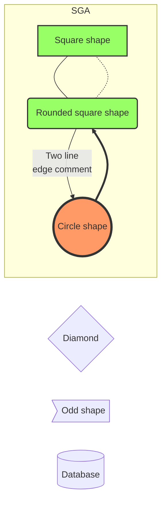

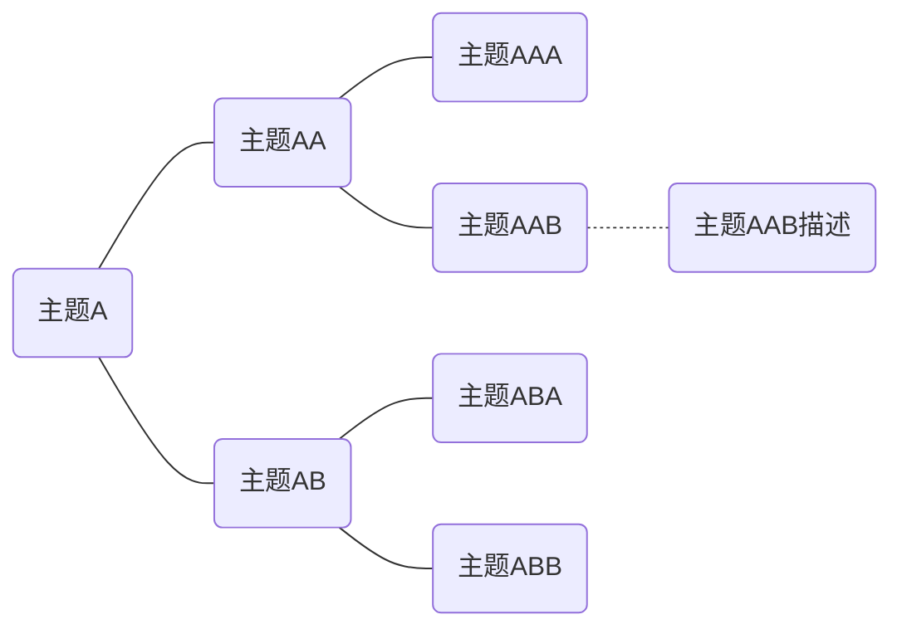

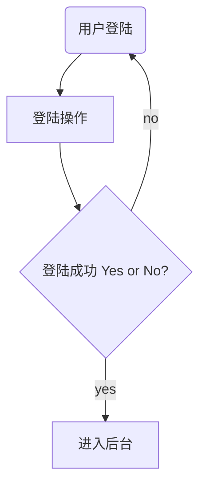

##### mermaid sequenceDiagram

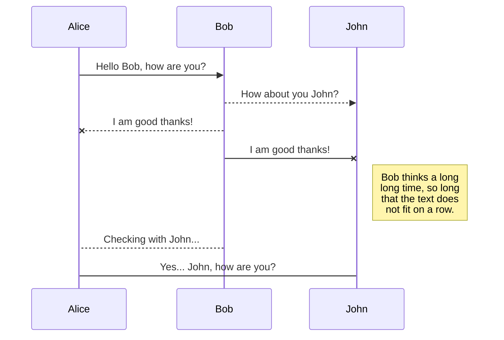

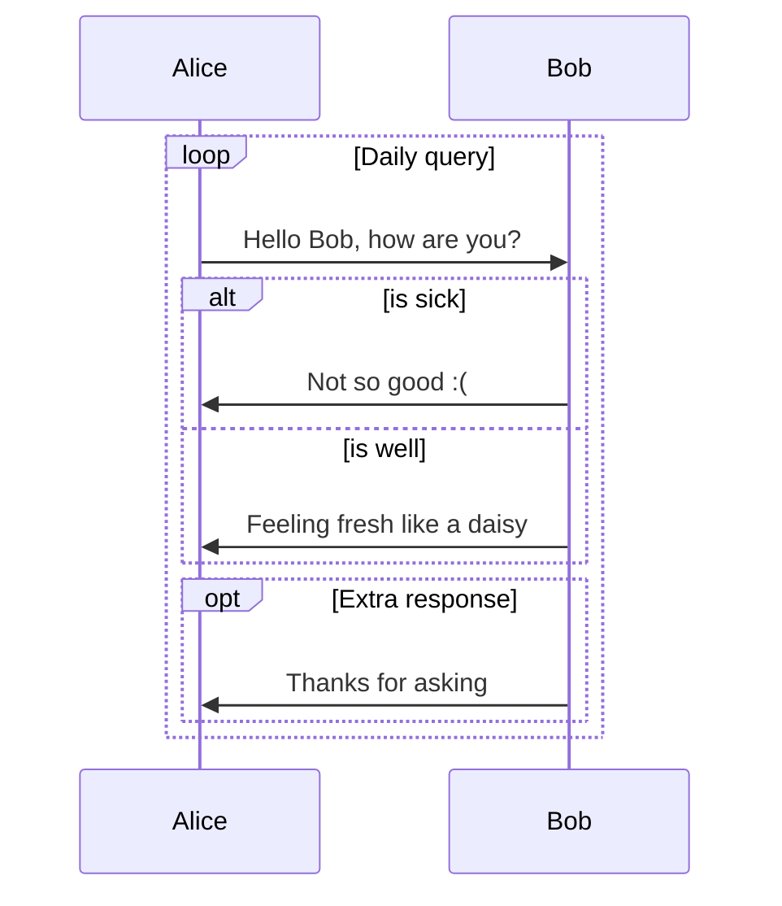

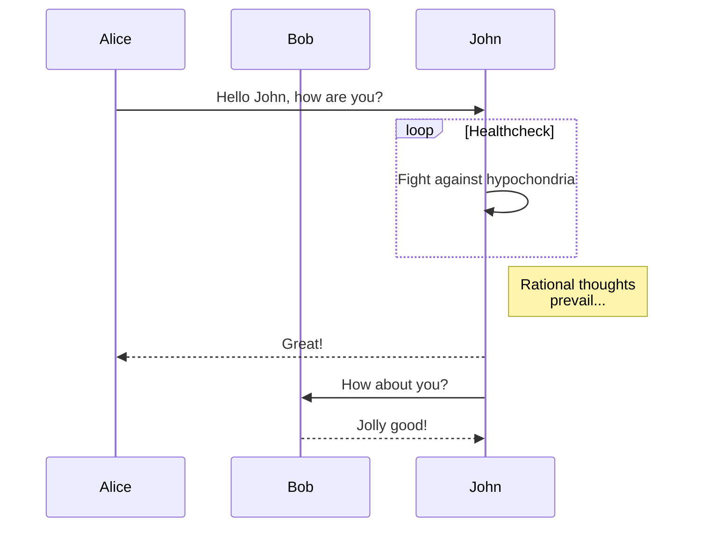

##### mermaid classDiagram

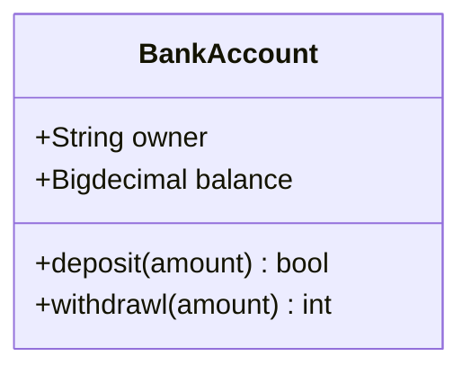

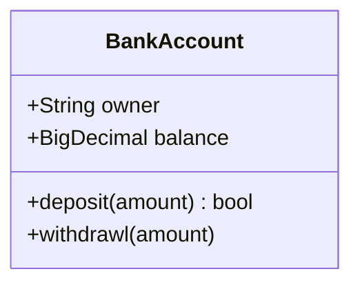

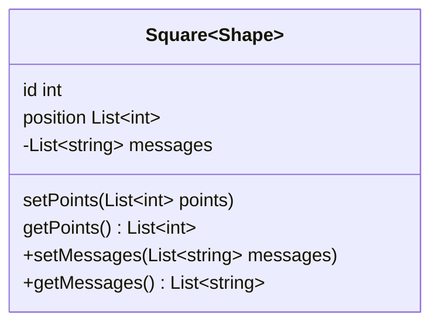

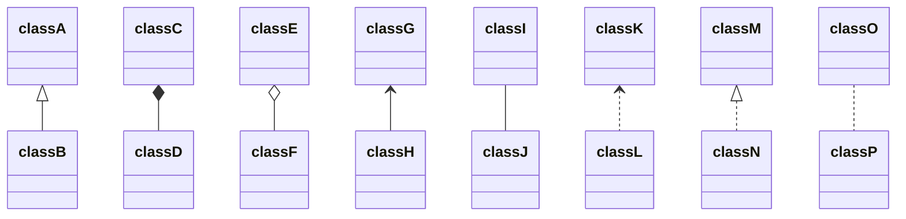
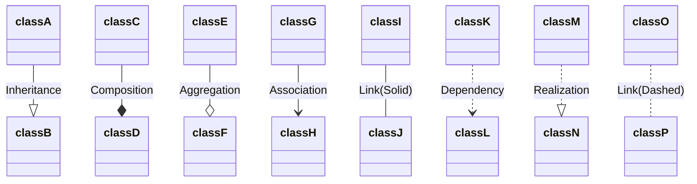

##### mermaid stateDiagram
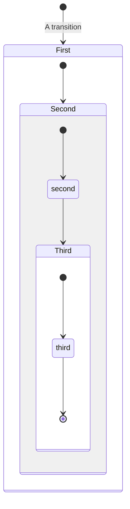

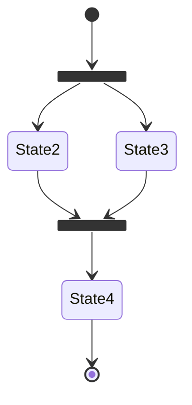

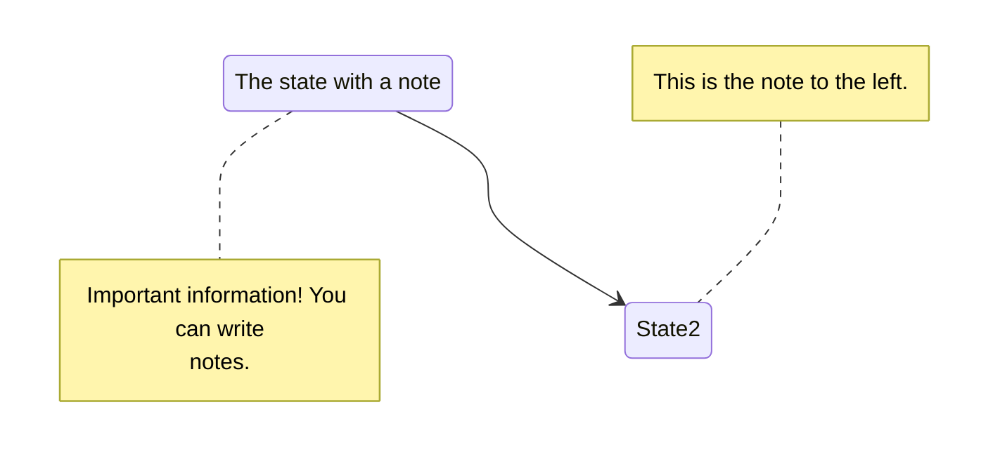

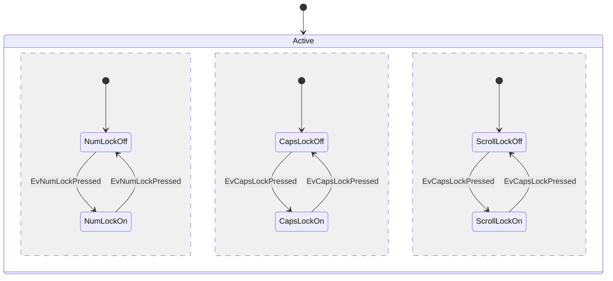

##### mermaid pie

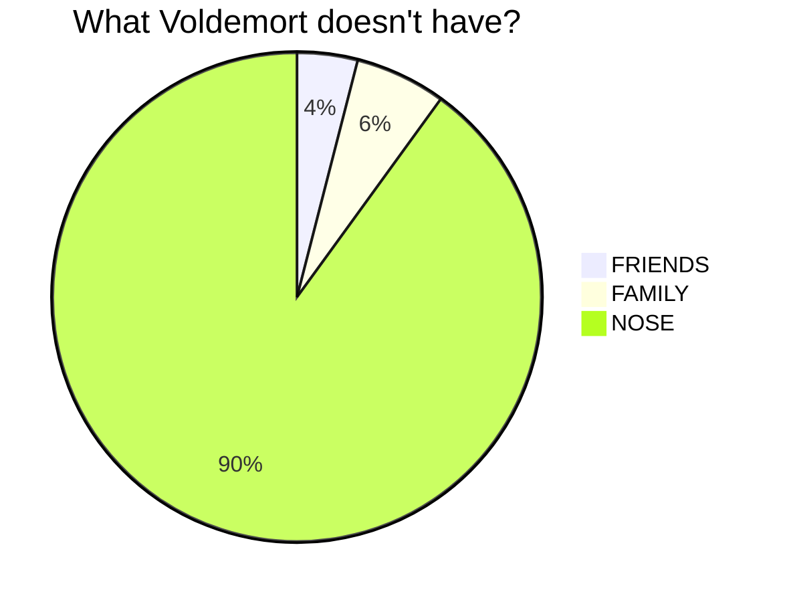

##### mermaid gantt

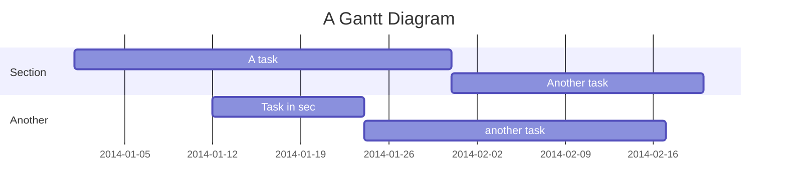

#### 绘制流程图 Flowchart

```flow
st=>start: 用户登陆
op=>operation: 登陆操作
cond=>condition: 登陆成功 Yes or No?
e=>end: 进入后台

st->op->cond
cond(yes)->e
cond(no)->op
```

#### 绘制序列图 Sequence Diagram

```sequence
    Alice ->> Bob: Hello Bob, how are you?
    Bob-->>John: How about you John?
    Bob--x Alice: I am good thanks!
    Bob-x John: I am good thanks!
    Note right of John: Bob thinks a long<br/>long time, so long<br/>that the text does<br/>not fit on a row.

    Bob-->Alice: Checking with John...
    Alice->John: Yes... John, how are you?
```

## 实践 （个人风格）

以三级标题为主，因为大小比较合适。

如果小标题是列举的，则用 list 代替否则用小标题。如果是不可列举的且是要缩进的则用 >。

标题的说明内容用 <p></p>，不必用 quoteblock。

"综上所述"的内容，放在分隔线下。内容不接上文也用分隔线隔开。

解释/补充的内容的用斜体。quoteblock 内解释/补充的内容不用斜体了，如果多行则排版麻烦。加粗同理。