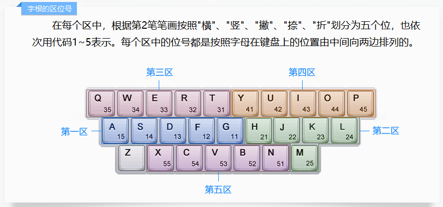
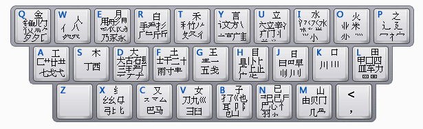
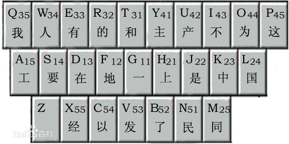
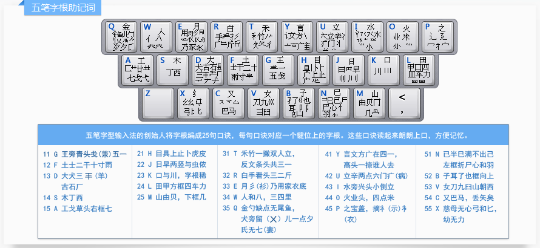

# 五笔教程

### refer:

金山打字通 2013 五笔教程
    
### 使用建议

这是个人使用五笔的总结，如果是新手建议结合金山打字通一起使用。可用于学习五笔前，大概了解五笔是怎样的，还可用于学习后的查漏补缺。

如果总结思路与你不符合，可不用理会。

这里就不匹配字拆分的笔画与部首的图了，可上相关五笔网站查询。

### 用五笔的原因
看了第一个打字的同学是用五笔，觉得很帅，所以先学了五笔，不太了解拼音，懒得学拼音。手机也是打笔画的。

## 字

### 字根分布的规律

根据“横竖撇捺折”将键盘划分为一个区。每个以根据“横竖撇捺折”划分为一个位。所以每个有字根的键位都可用“区位”来代表。“区”对应的是字根首笔画，“位”对应的字根次笔画。比如：G，“区位”为 11，字根的首笔画为“横”，次笔画为“横”。

首笔画的规律还是准的，次笔画的规律则不准。所以字根忘记可通过首笔画来推理出“区”。

还有就是字根结构类似的放在一块。比如：比的两个字根，田甲两个字根。这个是一般规律，不是绝对准，觉得没有用可忽略。

*字根的区位号*

*注意：M 是属于“竖”区的。*

*86字根表*

*“位”为 1 的键位在打笔画（横竖撇捺折。不是根据字型补最后一笔画。）时是代替笔画的。比如：属，NTKY；芯，ANU。    # 这个涉及打“字”原则的知识。*

### 打“字”原则：总体上是四个按键确定一个字，但是也有三个按键确定的。

- 键名汉字

	每键的首字根。连续输入四个相同的键。比如：金，QQQQ。

- 不足四键的字

    - 成字字根汉字
    
        先打字根所在键，再打其笔画（用“位”为 1 的键位），再补 'L'。比如：一，GGLL。
    
    - 合体字（非键名汉字且非成字字根汉字（由一个以上的字根或笔画组成））
    
    	先打完字所有字根或笔画，根据字型补最后一“笔画”（“位”123分别对应字型“左右”，“上下”，“其他”。这个偏难因为熟悉字型）。这样至少有三个键以上。比如：红，XAG；屯，GBNV。

- 大于四键的字

    - 成字字根汉字

        先打字根所在键，再打其笔画（用“位”为 1 的键位），第四键时补最后一划。比如：用，ETNH。

    - 合体字

        先打字的字根或笔画，第四键时补一个字根或笔划（用“位”为 1 的键位）。比如：剩，TUXJ。成，DNNT。

---

综上，一般规律是，除键名汉字，都是尽量打完字的字根或笔画，不足四键则补 'L'（一般不用打 'L' 因为候选字都是排第一位）或根据字型补最后一“笔画”（用“位”为 123 的键位）。多于四键时打最后一个字根或笔画（用“位”为 1 的键位）。

### 拆字规则（这里不细说）

- 书写顺序
	比如：伙，WOY。
- 取大优先
	比如：交，UQU。
- 能连不交
	比如：午，TFJ，而非 RHK。
- 能散不连
	比如：羊，UDJ，而非 UFHK。
                

*实践经验：记住字的组成部分（字根或笔画）不交叠即可，如果前面满足还有得选则取大优先。*
            

### 简码

因为字遵循二八原则，有常用字与非常用字，所以有了简码。比如：我，TRNT，是常用字，但是比较难打。所以用一个按键代替一个常用字会比较方便。比如：我，Q。这样的字也称为一级简码。

当然还有二级简码与三级简码。N 级简码的定义：N 个按键 + 空格，即可上屏。但是一级简码与二级简码、三级简码有区别的。区别是，一级简码是不符合打“字”原则所以要记忆，而二级简码、三级简码是符合打字原则的，它们与普通字的区别是打了 N 个键，加空格上屏即可，因为在候选字中排第一。一般记忆一级简码即可。当然记忆到二级简码会打字更快。

*一级简码*

## 词组

字大都是以词组的方式出现的，有二字，三字 ... 
        
打“词组”原则：尽量每个词组都有一个按键以上，不超过四个按键。

- 二字

	编码由每字的首次编码组成。
	
- 三字

	编码由前二字的首编码 + 最后一字的首次编码组成。
	
- 四字

	编码由每字的首编码组成。
	
- 四字以上

	编码由前三字的首编码 + 最后一字的首编码组成。

*比如：很好，TVVB；非常好，DIVB；乐于助人，QGEW；三思而后行，DLDT。*

## 其他

如果忘记单字的编码可用 Z 或打该字的词组代替。

“戈”，“成”等字，在五笔的笔画中，不同于正常的笔画，最后笔画是“撇”。  
“于” 最后笔画是 “竖”而不是“折”，手机的笔画中也是 “竖”。向右钩就是“折”了。

难拆分的字的也是有的，但是很少。比如：年，RHFK。

有些输入法可用

> 在选择候选字时，(;), (') 分别代表 1, 2。
> 
> ('）+ 英文字母 + 回车。可快速输入一串英文。d
> 
> Z + 单字拼音，可用拼音打忘记的汉字。

觉得适合自己的五笔输入法软件
- 精灵五笔
- 花儿五笔
            

记忆五笔字根心得

> 分时段默写五笔字根，同时拆解常用字。重复几天即可。

---

*五笔字根助记词（觉得难记可以不用此方法记）*

