# Markdown 的绘图

## mermaid (支持很多图，不能一一列举)

### mermaid graph

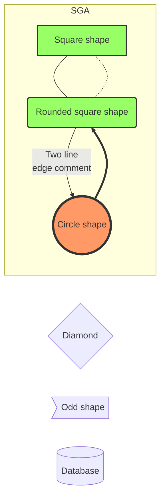

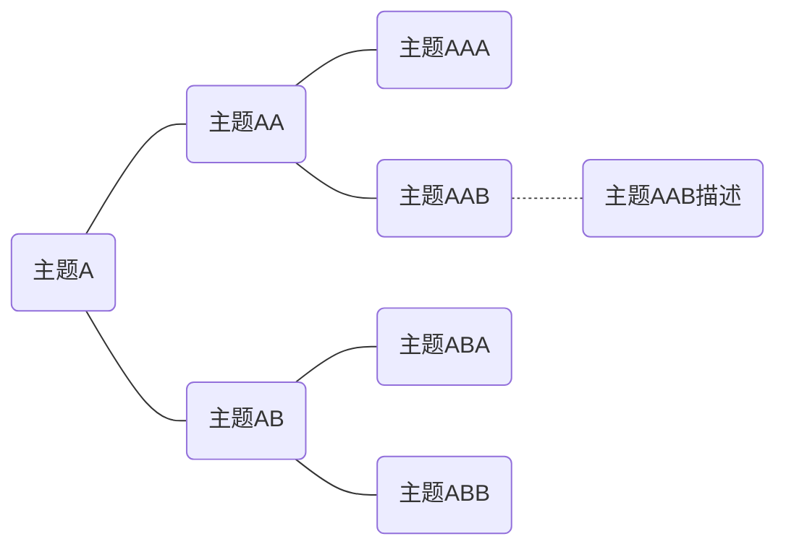

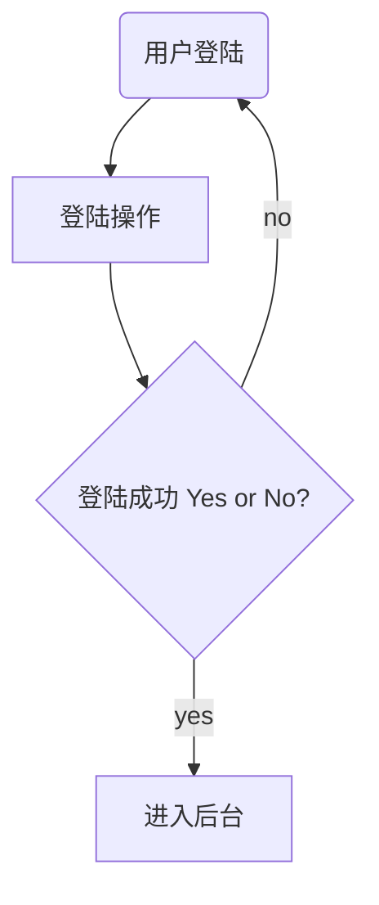

### mermaid sequenceDiagram

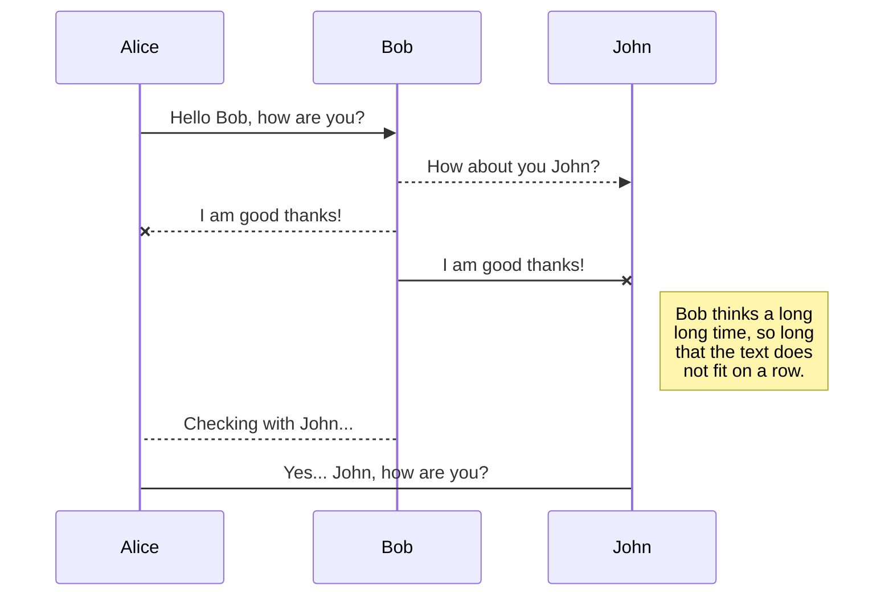

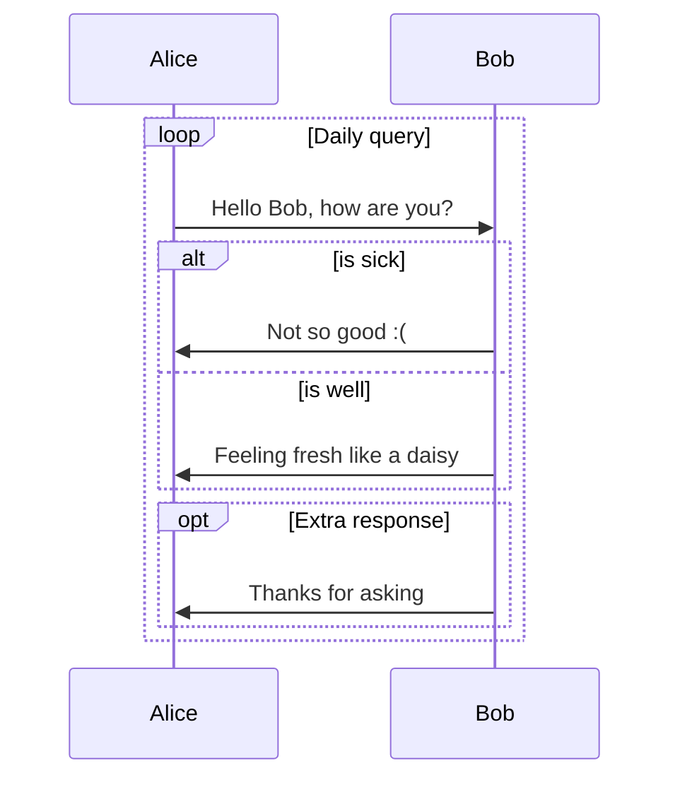

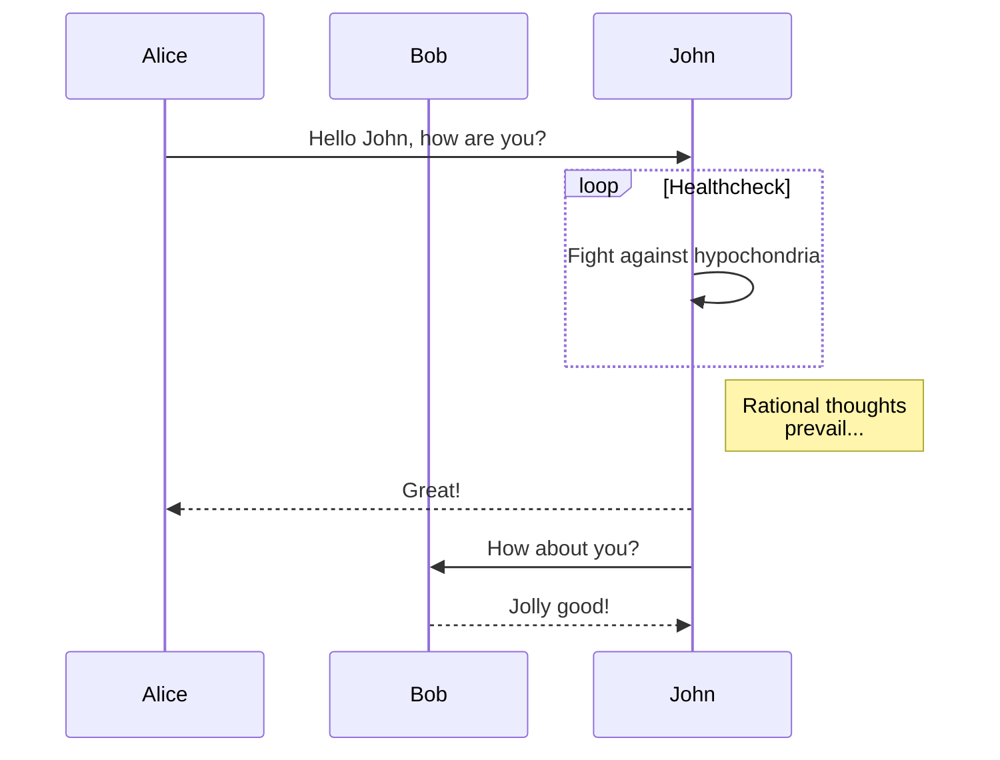

### mermaid classDiagram

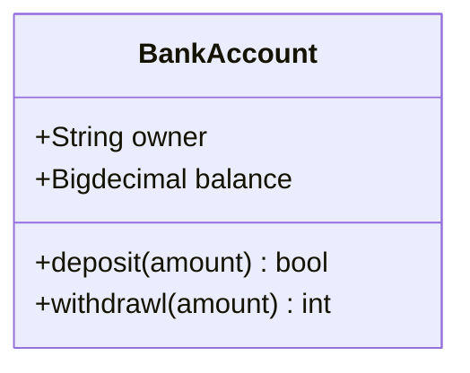

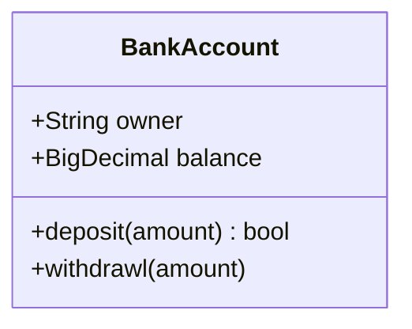

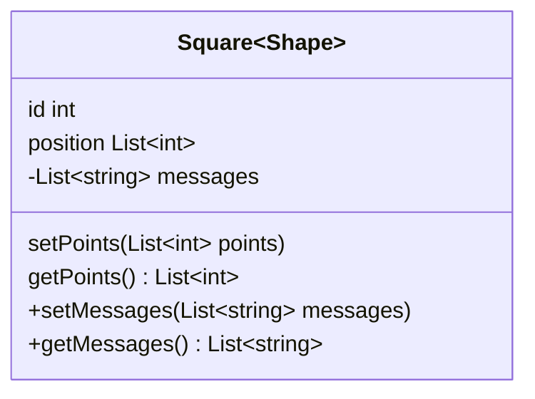

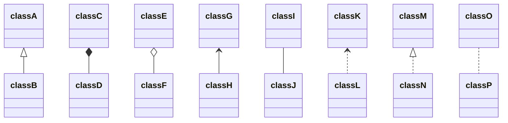
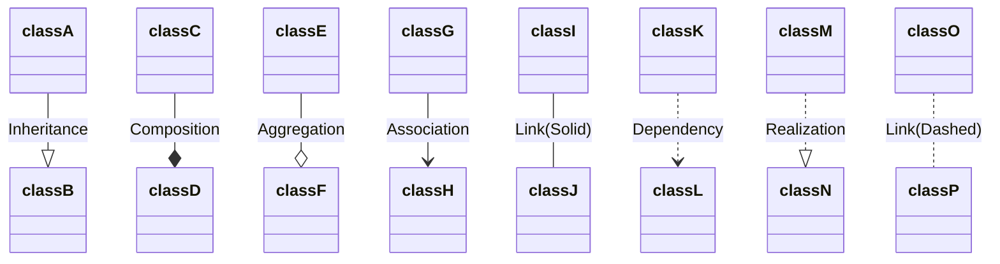

### mermaid stateDiagram

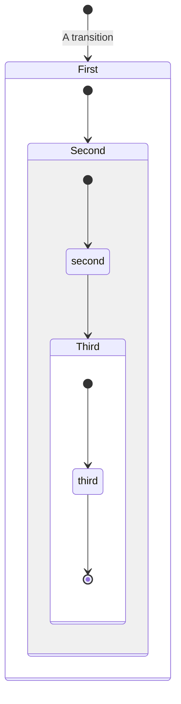

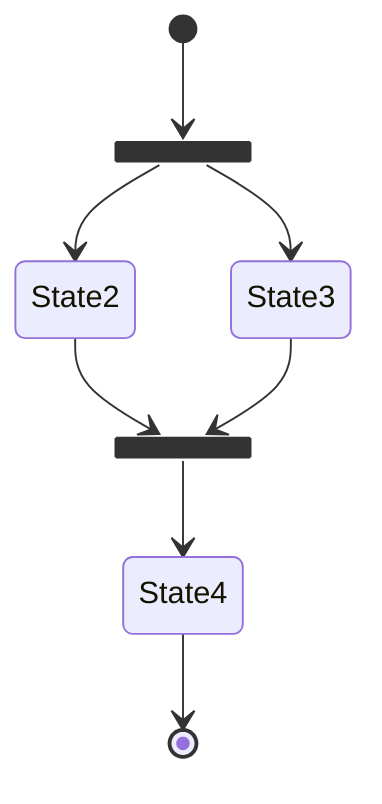

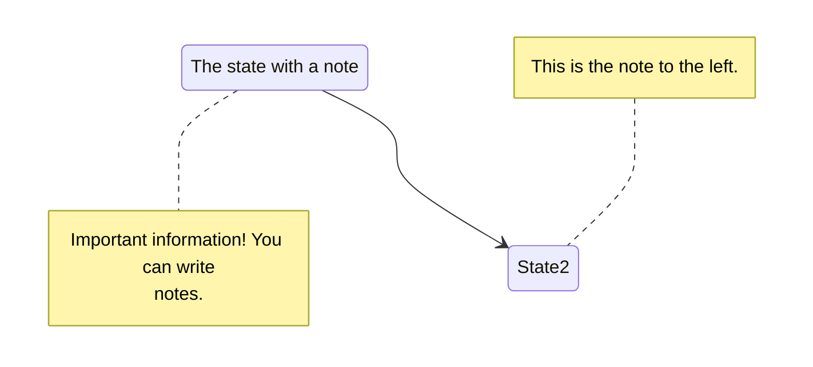

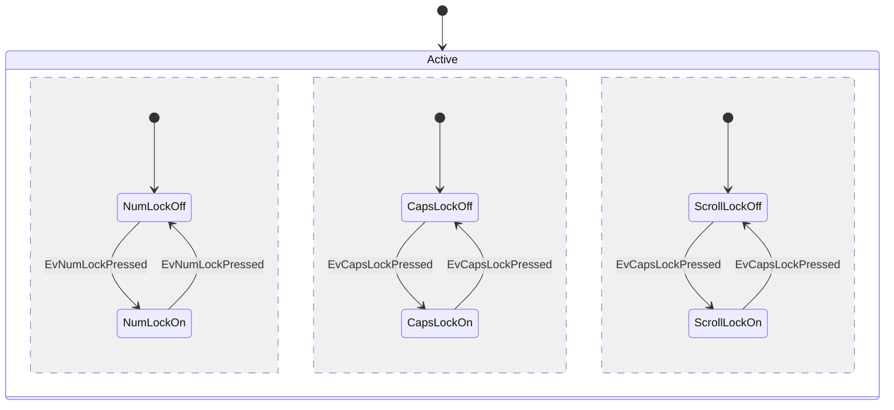

### mermaid pie

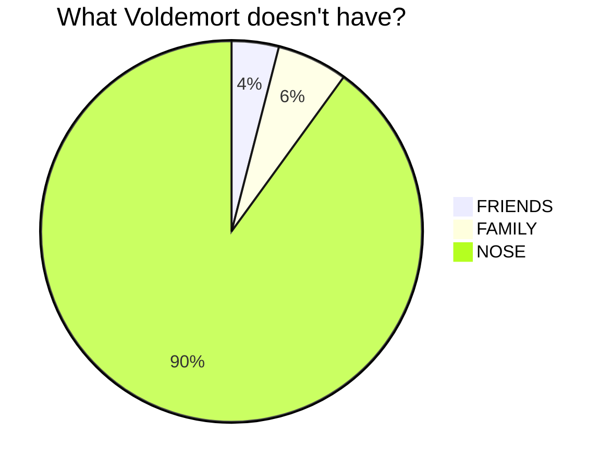

### mermaid gantt

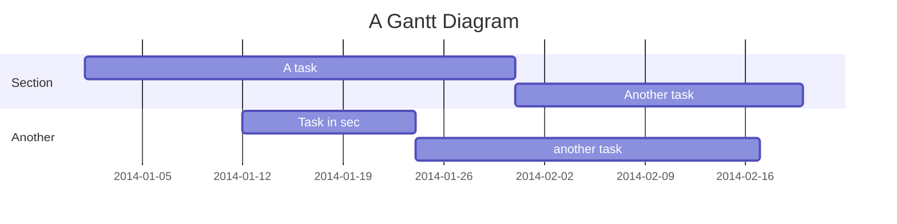

## 绘制流程图 Flowchart

```flow
st=>start: 用户登陆
op=>operation: 登陆操作
cond=>condition: 登陆成功 Yes or No?
e=>end: 进入后台

st->op->cond
cond(yes)->e
cond(no)->op
```

## 绘制序列图 Sequence Diagram

```sequence
    Alice ->> Bob: Hello Bob, how are you?
    Bob-->>John: How about you John?
    Bob--x Alice: I am good thanks!
    Bob-x John: I am good thanks!
    Note right of John: Bob thinks a long<br/>long time, so long<br/>that the text does<br/>not fit on a row.

    Bob-->Alice: Checking with John...
    Alice->John: Yes... John, how are you?
```
